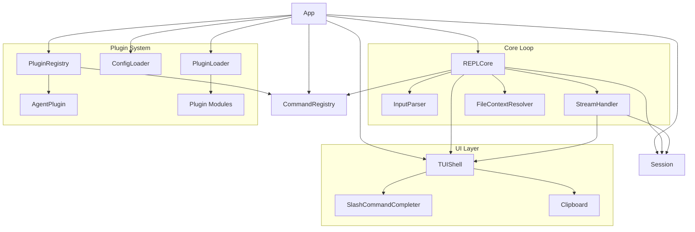

# Design Document: agent_repl Core

## Overview

`agent_repl` is a Python library providing a REPL-style TUI framework for building CLI applications that interact with AI agents. The architecture follows a modular design with clear separation between input handling, command dispatch, session management, agent communication, plugin extensibility, and terminal rendering.

The system is built on two key dependencies: `rich` for terminal output (markdown rendering, panels, live display, spinners) and `prompt_toolkit` for async input handling (history, key bindings, tab completion).

## Architecture



The application lifecycle:
1. `App.__init__` accepts a `Config` dataclass
2. `App.run()` calls `asyncio.run(self._run_async())`
3. `_run_async` creates subsystems (Session, TUIShell, CommandRegistry, TokenStatistics)
4. Built-in commands are registered
5. Config file plugins and code-specified plugins are loaded
6. Agent is initialized (factory or default Claude)
7. Completer is configured with all commands
8. `REPLCore.run_loop()` enters the main loop

The REPL loop:
1. `TUIShell.read_input()` prompts the user
2. `InputParser.parse_input()` classifies input
3. Slash commands → `CommandRegistry.get()` → handler execution
4. Free text → `FileContextResolver` → `AgentPlugin.send_message()` → `StreamHandler.handle_stream()`

## Components and Interfaces

### InputParser (`input_parser.py`)

Pure function module. No state.

```python
def parse_input(raw: str) -> ParsedInput:
    """Classify raw input as SLASH_COMMAND or FREE_TEXT, extract @mentions."""

def _is_slash_command(stripped: str) -> bool:
    """True if starts with / followed by non-whitespace, minimum 2 chars."""

def _parse_slash_command(stripped: str, raw: str) -> ParsedInput:
    """Split on first whitespace: command_name (without /) and args."""

def _parse_free_text(stripped: str, raw: str) -> ParsedInput:
    """Extract @mentions via regex r'@(\S+)'."""
```

Classification rules:
- Input is stripped before classification
- SLASH_COMMAND: `len(stripped) >= 2` and `stripped[0] == '/'` and `not stripped[1].isspace()`
- Everything else is FREE_TEXT
- `@mention` regex: `r'@(\S+)'` — captures everything after `@` until whitespace

### CommandRegistry (`command_registry.py`)

Stateful registry backed by a `dict[str, SlashCommand]`.

```python
class CommandRegistry:
    def register(self, command: SlashCommand) -> None: ...
    def get(self, name: str) -> SlashCommand | None: ...
    def all_commands(self) -> list[SlashCommand]: ...      # sorted by name
    def completions(self, prefix: str) -> list[str]: ...   # sorted, prefix match
    def pinned_commands(self, pinned_names: list[str]) -> list[SlashCommand]: ...
```

Pinned command resolution: iterate `pinned_names` in order (deduped), then append any `cmd.pinned=True` not already seen.

### SlashCommandCompleter (`completer.py`)

Implements `prompt_toolkit.completion.Completer`.

```python
class SlashCommandCompleter(Completer):
    def __init__(self, commands, pinned_names, max_pinned_display=MAX_PINNED_DISPLAY): ...
    def update_commands(self, commands, pinned_names) -> None: ...
    def suppress(self, text: str) -> None: ...
    def get_completions(self, document, complete_event) -> Iterable[Completion]: ...
```

Behavior:
- Input `"/"` → pinned completions only (capped at `max_pinned_display`)
- Input `"/<prefix>"` → all commands matching prefix, sorted
- Other input → no completions
- ESC suppression: sets `_suppressed=True` with current text; clears when text changes

Pinned resolution mirrors `CommandRegistry.pinned_commands` logic: config names first, then `pinned=True` commands, deduped, capped.

### Session (`session.py`)

Manages ordered conversation history and token accumulation.

```python
class Session:
    def add_turn(self, turn: ConversationTurn) -> None: ...
    def get_history(self) -> list[ConversationTurn]: ...   # returns copy
    def clear(self) -> None: ...
    def get_last_assistant_content(self) -> str | None: ...
    def replace_with_summary(self, summary: str) -> None: ...
```

Key behaviors:
- `add_turn` accumulates `token_usage` into `self.stats` if present
- `get_history` returns a shallow copy (list copy, not deep copy of turns)
- `get_last_assistant_content` iterates reversed history for `role == "assistant"`
- `replace_with_summary` clears and adds a single assistant turn

### FileContextResolver (`file_context.py`)

Pure function module. Resolves paths to `FileContent` objects.

```python
def resolve_file_context(paths: list[str]) -> list[FileContent]: ...
def _resolve_file(path: Path) -> FileContent: ...
def _resolve_directory(path: Path) -> list[FileContent]: ...
```

Behaviors:
- Files: read as UTF-8, raise `FileContextError` on `UnicodeDecodeError`
- Directories: `path.rglob("*")`, sorted, files only, each read as UTF-8
- Missing paths: raise `FileContextError`

### Clipboard (`clipboard.py`)

Platform-aware clipboard copy.

```python
def _get_clipboard_cmd() -> list[str]: ...
def copy_to_clipboard(text: str) -> None: ...
```

Platform detection:
- `sys.platform == "darwin"` → `["pbcopy"]`
- Linux + Wayland (`WAYLAND_DISPLAY` or `XDG_SESSION_TYPE == "wayland"`) → `["wl-copy"]`
- Linux + X11 → `["xclip", "-selection", "clipboard"]`
- Other → `ClipboardError`

Checks `shutil.which(utility)` before running. Encodes text as UTF-8 for subprocess stdin.

### StreamHandler (`stream_handler.py`)

Async function that consumes `AsyncIterator[StreamEvent]` and coordinates TUI display.

```python
async def handle_stream(
    stream: AsyncIterator[StreamEvent],
    tui: TUIShell,
    session: Session,
    stats: TokenStatistics,
) -> ConversationTurn: ...
```

Event handling:
- `TEXT_DELTA`: stop spinner on first content, start stream on first text, append text
- `TOOL_USE_START`: stop spinner on first content, display tool info
- `TOOL_RESULT`: display panel, record tool use dict
- `USAGE`: create `TokenUsage`, accumulate into stats
- `ERROR`: stop spinner, display error

Always: stop spinner in finally, finish stream if started, create and add `ConversationTurn` to session.

### TUIShell (`tui.py`)

Terminal UI combining Rich (output) and prompt_toolkit (input).

```python
class TUIShell:
    def set_session(self, session: Session) -> None: ...
    def set_completer(self, commands, pinned_names) -> None: ...
    async def read_input(self) -> str: ...
    def display_text(self, text: str) -> None: ...          # markdown
    def display_tool_result(self, name, content, is_error) -> None: ...  # panel
    def display_error(self, message: str) -> None: ...
    def display_info(self, message: str) -> None: ...
    def start_stream(self) -> None: ...
    def append_stream(self, text: str) -> None: ...
    def finish_stream(self) -> str: ...
    def start_spinner(self) -> None: ...
    def stop_spinner(self) -> None: ...
```

Key bindings:
- `Ctrl+Y`: copy last assistant output to clipboard
- `ESC` (when completions visible): dismiss completions and suppress

Streaming display uses `Rich.Live` with a custom `_LeftGutter` renderable that prepends a colored bar character (`▎`) to each line.

### PluginLoader (`plugin_loader.py`)

```python
def load_plugins(plugin_names: list[str], app_context: AppContext) -> list[Plugin]: ...
```

For each dotted module path: `importlib.import_module(name)` → `module.create_plugin()`. Logs and skips on failure.

### PluginRegistry (`plugin_registry.py`)

```python
class PluginRegistry:
    def register_plugin(self, plugin: Plugin) -> None: ...
    @property
    def agent_plugin(self) -> AgentPlugin | None: ...
    @property
    def plugins(self) -> list[Plugin]: ...
```

Agent detection: duck-typing via `hasattr(plugin, "send_message") and hasattr(plugin, "compact_history")`. First match becomes the active agent.

### ConfigLoader (`config_loader.py`)

```python
def load_config(config_dir: Path) -> dict: ...
```

Reads `{config_dir}/.af/plugins.toml`. Creates with default template if missing. Returns parsed dict, empty dict on malformed TOML.

### ClaudeAgentPlugin (`agents/claude_agent.py`)

```python
class ClaudeAgentPlugin:
    async def send_message(self, message, file_context, history) -> AsyncIterator[StreamEvent]: ...
    async def compact_history(self, history) -> str: ...
    def get_commands(self) -> list[SlashCommand]: ...  # /clear, /compact
```

Auth: checks `CLAUDE_CODE_USE_VERTEX` + `ANTHROPIC_VERTEX_PROJECT_ID` for Vertex, or `ANTHROPIC_API_KEY` for API key. Raises `AgentError` if neither configured.

Prompt building: concatenates history as `"User: ..."` / `"Assistant: ..."` lines, prepends file context as `<file path="...">` blocks.

### Built-in Commands (`builtin_commands.py`)

Four commands: `/help`, `/quit`, `/version`, `/copy`. All returned by `get_builtin_commands()`.

### Protocols (`types.py`)

```python
class Plugin(Protocol):
    name: str                                    # property
    description: str                             # property
    def get_commands(self) -> list[SlashCommand]: ...
    async def on_load(self, app_context: AppContext) -> None: ...
    async def on_unload(self) -> None: ...

class AgentPlugin(Plugin, Protocol):
    async def send_message(self, message, file_context, history) -> AsyncIterator[StreamEvent]: ...
    async def compact_history(self, history) -> str: ...
```

### Constants (`constants.py`)

- `DEFAULT_CLAUDE_MODEL = "claude-opus-4-6"`
- `DEFAULT_PINNED_COMMANDS = ["help", "quit"]`
- `MAX_PINNED_DISPLAY = 6`

### Exceptions (`exceptions.py`)

- `FileContextError` — file resolution failures
- `PluginLoadError` — plugin import failures
- `AgentError` — agent interaction failures
- `ConfigError` — configuration failures
- `ClipboardError` — clipboard operation failures

## Data Models

### Configuration

```python
@dataclass
class Theme:
    prompt_color: str = "green"
    cli_output_color: str = "dim"
    agent_gutter_color: str = "blue"
    agent_text_color: str = ""
    tool_color: str = "cyan"
    tool_error_color: str = "red"

@dataclass
class Config:
    app_name: str
    app_version: str
    default_model: str
    agent_factory: Callable[[Config], AgentPlugin] | None = None
    plugins: list[str] = field(default_factory=list)
    theme: Theme = field(default_factory=Theme)
    pinned_commands: list[str] | None = None
```

### Input Types

```python
class InputType(Enum):
    SLASH_COMMAND = "slash_command"
    FREE_TEXT = "free_text"

@dataclass
class ParsedInput:
    input_type: InputType
    raw: str
    command_name: str | None = None
    command_args: str | None = None
    at_mentions: list[str] = field(default_factory=list)
```

### Stream Types

```python
class StreamEventType(Enum):
    TEXT_DELTA = "text_delta"
    TOOL_USE_START = "tool_use_start"
    TOOL_INPUT_DELTA = "tool_input_delta"
    TOOL_RESULT = "tool_result"
    USAGE = "usage"
    ERROR = "error"

@dataclass
class StreamEvent:
    type: StreamEventType
    content: str = ""
    metadata: dict = field(default_factory=dict)
```

### Session Types

```python
@dataclass
class FileContent:
    path: str
    content: str

@dataclass
class ConversationTurn:
    role: str  # "user" or "assistant"
    content: str
    file_context: list[FileContent] = field(default_factory=list)
    tool_uses: list[dict] = field(default_factory=list)
    token_usage: TokenUsage | None = None

@dataclass
class TokenUsage:
    input_tokens: int = 0
    output_tokens: int = 0

@dataclass
class TokenStatistics:
    total_input_tokens: int = 0
    total_output_tokens: int = 0
    def accumulate(self, usage: TokenUsage) -> None: ...
```

### Command Types

```python
@dataclass
class SlashCommand:
    name: str
    description: str
    help_text: str
    handler: Callable[[CommandContext], None]
    pinned: bool = False

@dataclass
class CommandContext:
    args: str
    app_context: AppContext

@dataclass
class AppContext:
    config: Config
    session: Session
    tui: TUIShell
    command_registry: CommandRegistry
    stats: TokenStatistics
```


## Correctness Properties

*A property is a characteristic or behavior that should hold true across all valid executions of a system — essentially, a formal statement about what the system should do. Properties serve as the bridge between human-readable specifications and machine-verifiable correctness guarantees.*

The following properties are derived from the acceptance criteria in the requirements document. Each property is universally quantified and suitable for property-based testing with hypothesis.

### Property 1: Input classification is exhaustive and correct

*For any* string `s`, `parse_input(s)` classifies it as `SLASH_COMMAND` if and only if `s.strip()` has length ≥ 2, starts with `/`, and the second character is not whitespace; otherwise it classifies as `FREE_TEXT`.

**Validates: Requirements 1.1, 1.2, 1.6**

### Property 2: At-mention extraction captures all @references

*For any* free-text input containing `@` followed by non-whitespace sequences, `parse_input` extracts exactly the set of non-whitespace strings following each `@`.

**Validates: Requirements 1.3**

### Property 3: Slash command round-trip (name + args reconstruction)

*For any* valid command name (non-empty, no whitespace) and any argument string, constructing `"/" + name + " " + args` and parsing it produces a `ParsedInput` with `command_name == name` and `command_args == args`.

**Validates: Requirements 1.4, 1.5**

### Property 4: Command register/get round trip

*For any* `SlashCommand`, after registering it in a `CommandRegistry`, `get(command.name)` returns that command. For any name not registered, `get(name)` returns `None`.

**Validates: Requirements 2.1, 2.2, 2.3**

### Property 5: All commands are sorted

*For any* set of registered commands, `all_commands()` returns them sorted alphabetically by name.

**Validates: Requirements 2.4**

### Property 6: Prefix completions are correct and sorted

*For any* set of registered commands and any prefix string, `completions(prefix)` returns exactly the command names starting with that prefix, sorted alphabetically.

**Validates: Requirements 2.5**

### Property 7: Pinned command resolution ordering and deduplication

*For any* set of registered commands, pinned flags, and pinned_names list, `pinned_commands(pinned_names)` returns commands in pinned_names order first, then `pinned=True` commands not already included, with no duplicates.

**Validates: Requirements 2.6, 3.6**

### Property 8: Completer bare slash yields only pinned commands

*For any* set of commands and pinned configuration, when the input is exactly `"/"`, the completer yields only the resolved pinned commands, capped at `max_pinned_display`.

**Validates: Requirements 3.1**

### Property 9: Completer prefix filtering matches correctly

*For any* set of commands and any prefix, when the input is `"/" + prefix` (with non-empty prefix), the completer yields exactly the commands whose names start with that prefix, sorted alphabetically.

**Validates: Requirements 3.2**

### Property 10: Completer yields nothing for non-slash input

*For any* input string that does not start with `"/"`, the completer yields no completions.

**Validates: Requirements 3.3**

### Property 11: Completer suppression lifecycle

*For any* completer state, after calling `suppress(text)`, completions for the same `text` are empty. After the input changes to a different text, completions resume normally.

**Validates: Requirements 3.4, 3.5**

### Property 12: Session history preserves insertion order and returns a copy

*For any* sequence of `ConversationTurn` objects added to a `Session`, `get_history()` returns them in insertion order, and the returned list is a distinct object from the internal list (mutation-safe).

**Validates: Requirements 4.1, 4.3**

### Property 13: Session token accumulation is additive

*For any* sequence of turns with `TokenUsage`, the session's `TokenStatistics.total_input_tokens` equals the sum of all `input_tokens`, and `total_output_tokens` equals the sum of all `output_tokens`.

**Validates: Requirements 4.2**

### Property 14: Session last assistant content returns most recent

*For any* sequence of conversation turns with mixed roles, `get_last_assistant_content()` returns the content of the last turn with `role == "assistant"`, or `None` if no assistant turns exist.

**Validates: Requirements 4.5, 4.6**

### Property 15: Session replace_with_summary produces single-turn history

*For any* non-empty session and any summary string, after `replace_with_summary(summary)`, the history contains exactly one turn with `role == "assistant"` and `content == summary`.

**Validates: Requirements 4.4, 4.7**

### Property 16: File context round trip for text files

*For any* text file with valid UTF-8 content, `resolve_file_context([path])` returns a `FileContent` with the same path and content as written.

**Validates: Requirements 5.1**

### Property 17: Directory resolution returns all files sorted

*For any* directory containing text files, `resolve_file_context([dir_path])` returns `FileContent` objects for all files (recursively), sorted by path.

**Validates: Requirements 5.2**

### Property 18: Missing path raises FileContextError

*For any* path that does not exist on the filesystem, `resolve_file_context([path])` raises `FileContextError`.

**Validates: Requirements 5.3**

### Property 19: Binary file raises FileContextError

*For any* file containing non-UTF-8 bytes, `resolve_file_context([path])` raises `FileContextError`.

**Validates: Requirements 5.4**

### Property 20: Stream handler turn content equals concatenated text deltas

*For any* sequence of `StreamEvent` objects, the `ConversationTurn` returned by `handle_stream` has `content` equal to the concatenation of all `TEXT_DELTA` event contents in order.

**Validates: Requirements 7.1, 7.7**

### Property 21: Stream handler records all tool uses

*For any* sequence of `StreamEvent` objects containing `TOOL_RESULT` events, the resulting `ConversationTurn.tool_uses` list contains an entry for each `TOOL_RESULT` event with matching `tool_id`, `content`, and `is_error`.

**Validates: Requirements 7.4**

### Property 22: Stream handler accumulates token usage

*For any* sequence of `StreamEvent` objects containing `USAGE` events, the `TokenStatistics` passed to `handle_stream` has its totals incremented by the sum of all usage event token counts.

**Validates: Requirements 7.5**

## Error Handling

### Exception Hierarchy

All custom exceptions inherit from `Exception`:

| Exception | Module | Raised When |
|-----------|--------|-------------|
| `FileContextError` | `file_context.py` | Path missing, binary file, read failure |
| `PluginLoadError` | `plugin_loader.py` | Plugin import or factory failure |
| `AgentError` | `agents/claude_agent.py` | Auth missing, connection failure, process error |
| `ConfigError` | `config_loader.py` | Config validation failure |
| `ClipboardError` | `clipboard.py` | Unsupported platform, missing utility, subprocess failure |

### Error Propagation Strategy

- **InputParser**: No exceptions — all input is valid (classified as FREE_TEXT or SLASH_COMMAND)
- **CommandRegistry**: No exceptions — returns `None` for missing commands
- **Session**: No exceptions — all operations are in-memory
- **FileContextResolver**: Raises `FileContextError` — caught by `REPLCore._dispatch_free_text`
- **Clipboard**: Raises `ClipboardError` — caught by `/copy` handler and `Ctrl+Y` handler
- **StreamHandler**: Catches `asyncio.CancelledError` in REPLCore; other exceptions propagate to REPLCore's catch-all
- **PluginLoader**: Catches all exceptions internally, logs, and continues
- **ConfigLoader**: Catches `tomllib.TOMLDecodeError` and `OSError` internally, logs, returns fallback
- **ClaudeAgentPlugin**: Wraps SDK exceptions (`CLINotFoundError`, `CLIConnectionError`, `ProcessError`, `CLIJSONDecodeError`) into `AgentError`

### REPLCore Error Boundaries

The REPL loop has three error boundaries:
1. **Command dispatch**: catches all exceptions except `SystemExit`, displays error
2. **Free text dispatch**: catches `asyncio.CancelledError` (displays cancellation info), catches all other exceptions (displays error)
3. **Main loop**: catches `EOFError`, `KeyboardInterrupt` (exit or cancel), `SystemExit` (exit)

## Testing Strategy

### Dual Testing Approach

The project uses both unit tests and property-based tests:

- **Unit tests** (`pytest`): Specific examples, edge cases, error conditions, integration points, mocked external dependencies
- **Property-based tests** (`hypothesis`): Universal properties across randomly generated inputs for pure/testable modules

### Property-Based Testing Configuration

- **Library**: `hypothesis` (already a dev dependency)
- **Minimum iterations**: 100 per property (hypothesis default `max_examples=100`)
- **Tag format**: Comment `# Feature: agent-repl-core, Property N: <title>` above each property test
- **Each correctness property maps to exactly one property-based test function**

### Test Organization

Tests live in `tests/` at the project root:

| Test File | Module Under Test | Test Type |
|-----------|-------------------|-----------|
| `test_input_parser.py` | `input_parser.py` | Property (P1, P2, P3) + unit |
| `test_command_registry.py` | `command_registry.py` | Property (P4, P5, P6, P7) + unit |
| `test_completer.py` | `completer.py` | Property (P8, P9, P10, P11) + unit |
| `test_session.py` | `session.py` | Property (P12, P13, P14, P15) + unit |
| `test_file_context.py` | `file_context.py` | Property (P16, P17, P18, P19) + unit |
| `test_clipboard.py` | `clipboard.py` | Unit (platform mocking) |
| `test_stream_handler.py` | `stream_handler.py` | Property (P20, P21, P22) + unit |
| `test_config_loader.py` | `config_loader.py` | Unit (filesystem mocking) |
| `test_plugin_system.py` | `plugin_loader.py`, `plugin_registry.py` | Unit |
| `test_builtin_commands.py` | `builtin_commands.py` | Unit |
| `test_app.py` | `app.py` | Unit (integration) |
| `test_repl.py` | `repl.py` | Unit (integration) |
| `test_tui.py` | `tui.py` | Unit |
| `test_types.py` | `types.py` | Unit |
| `test_claude_agent.py` | `agents/claude_agent.py` | Unit (mocked SDK) |

### Modules Suitable for Property-Based Testing

The following modules are pure or have testable logic suitable for PBT:
- `input_parser` — pure functions, no I/O
- `command_registry` — in-memory data structure
- `completer` — deterministic completion logic
- `session` — in-memory state management
- `file_context` — filesystem I/O but testable with temp files
- `stream_handler` — async but testable with mock TUI/session

### Modules Tested with Unit Tests Only

- `clipboard` — platform-dependent, requires mocking
- `config_loader` — filesystem I/O with TOML parsing, requires mocking
- `plugin_loader` / `plugin_registry` — import machinery, requires mocking
- `builtin_commands` — command handlers with side effects
- `tui` — Rich/prompt_toolkit rendering
- `app` / `repl` — orchestration and integration
- `claude_agent` — external SDK dependency
