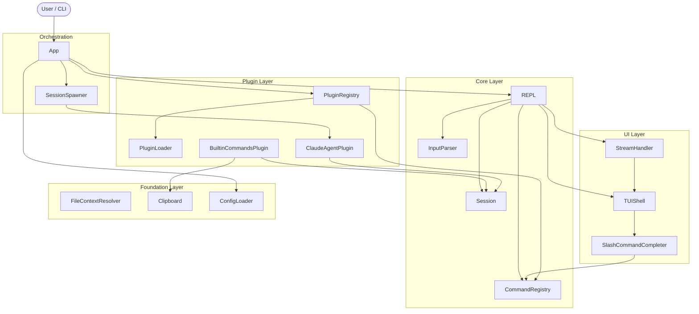

# Design Document: agent_repl

## Overview

agent_repl is a layered Python library built on asyncio. Every user-facing
capability is a plugin. The architecture separates concerns into four layers:
a **Foundation** layer of standalone utilities, a **Core** layer for session
state and command dispatch, a **UI** layer for terminal rendering and input, and
an **Orchestration** layer that wires everything together. An **Agent** layer
sits alongside these, providing the default Claude integration and session
spawning.

## Architecture



### Module Responsibilities

1. **types.py** -- Core data types, protocols, and enums (`Config`, `Theme`,
   `SlashCommand`, `Plugin`, `AgentPlugin`, `StreamEvent`, `StreamEventType`,
   `ConversationTurn`, `TokenUsage`, `TokenStatistics`, `FileContext`,
   `ToolUse`, `MessageContext`, `CommandContext`, `PluginContext`,
   `SpawnConfig`).
2. **constants.py** -- Default values, magic strings, and limits.
3. **exceptions.py** -- Custom exception hierarchy (`AgentReplError`,
   `AgentError`, `PluginError`, `ConfigError`, `ClipboardError`,
   `FileContextError`).
4. **input_parser.py** -- Classifies input as slash command or free text;
   extracts `@path` mentions.
5. **file_context.py** -- Resolves `@path` references to file/directory
   contents with `.gitignore` filtering and size limits.
6. **clipboard.py** -- Platform-aware clipboard copy using `pbcopy`,
   `wl-copy`, or `xclip`.
7. **session.py** -- Maintains conversation history and accumulates token
   statistics.
8. **command_registry.py** -- Stores `SlashCommand` objects; supports lookup,
   listing, prefix completion, and pinned command resolution.
9. **config_loader.py** -- Loads and validates `.af/config.toml`; creates
   default template if missing.
10. **plugin_loader.py** -- Imports plugin modules by dotted path; calls
    `create_plugin()` factories.
11. **plugin_registry.py** -- Manages plugin lifecycle; registers commands;
    enforces single-agent constraint.
12. **stream_handler.py** -- Processes `StreamEvent` objects and drives TUI
    rendering (live text, tool panels, spinner, error display).
13. **tui.py** -- Rich-based output rendering and prompt_toolkit-based async
    input with history, toolbar, and completions.
14. **completer.py** -- prompt_toolkit `Completer` for slash commands with
    pinned-first and prefix-filtered modes; ESC dismissal.
15. **repl.py** -- The main read-eval-print loop; classifies input, dispatches
    commands, invokes the agent, handles Ctrl+C/D.
16. **builtin_commands.py** -- Built-in commands (`/help`, `/quit`, `/version`,
    `/copy`, `/agent`, `/stats`) implemented as a plugin.
17. **app.py** -- Top-level entry point; wires all subsystems, loads plugins,
    starts the REPL or dispatches a CLI command.
18. **agents/claude_agent.py** -- Default Claude agent plugin using
    `claude_agent_sdk`.
19. **agents/\_\_init\_\_.py** -- Agents sub-package.

## Components and Interfaces

### Public API (`__init__.py` Exports)

```python
from agent_repl.types import (
    App,
    Config,
    Theme,
    Plugin,
    AgentPlugin,
    SlashCommand,
    StreamEvent,
    StreamEventType,
)
```

### Core Data Types (`types.py`)

```python
from dataclasses import dataclass, field
from enum import Enum
from typing import Any, AsyncIterator, Callable, Protocol, runtime_checkable


# --- Enums ---

class StreamEventType(Enum):
    TEXT_DELTA = "text_delta"
    TOOL_USE_START = "tool_use_start"
    TOOL_RESULT = "tool_result"
    USAGE = "usage"
    ERROR = "error"


# --- Value Objects ---

@dataclass(frozen=True)
class Theme:
    prompt_color: str = "green"
    gutter_color: str = "blue"
    error_color: str = "red"
    info_color: str = "cyan"


@dataclass(frozen=True)
class StreamEvent:
    type: StreamEventType
    data: dict[str, Any] = field(default_factory=dict)


@dataclass(frozen=True)
class TokenUsage:
    input_tokens: int = 0
    output_tokens: int = 0


@dataclass(frozen=True)
class FileContext:
    path: str
    content: str | None = None
    error: str | None = None


@dataclass(frozen=True)
class ToolUse:
    name: str
    input: dict[str, Any] = field(default_factory=dict)
    result: str | None = None
    is_error: bool = False


@dataclass
class ConversationTurn:
    role: str                                       # "user" | "assistant" | "system"
    content: str
    file_contexts: list[FileContext] = field(default_factory=list)
    tool_uses: list[ToolUse] = field(default_factory=list)
    usage: TokenUsage | None = None


# --- Configuration ---

@dataclass
class SlashCommand:
    name: str
    description: str
    handler: Callable[["CommandContext"], Any]       # async callable
    cli_exposed: bool = False
    pinned: bool = False


@dataclass
class Config:
    app_name: str = "agent_repl"
    app_version: str = "0.1.0"
    theme: Theme = field(default_factory=Theme)
    agent_factory: Callable[..., "AgentPlugin"] | None = None
    plugins: list[str] = field(default_factory=list)
    pinned_commands: list[str] = field(default_factory=lambda: ["help", "quit"])
    max_pinned_display: int = 6
    max_file_size: int = 512_000                    # bytes
    cli_commands: list[str] = field(default_factory=list)


@dataclass
class SpawnConfig:
    prompt: str
    pre_hook: Callable[[], None] | None = None
    post_hook: Callable[[], None] | None = None


# --- Contexts ---

@dataclass
class MessageContext:
    message: str
    file_contexts: list[FileContext] = field(default_factory=list)
    history: list[ConversationTurn] = field(default_factory=list)


@dataclass
class CommandContext:
    args: str                                       # raw argument string
    argv: list[str] = field(default_factory=list)   # parsed argument list
    session: Any = None                             # Session
    tui: Any = None                                 # TUIShell
    config: Config = field(default_factory=Config)
    registry: Any = None                            # CommandRegistry
    plugin_registry: Any = None                     # PluginRegistry


@dataclass
class PluginContext:
    config: Config = field(default_factory=Config)
    session: Any = None                             # Session
    tui: Any = None                                 # TUIShell
    registry: Any = None                            # CommandRegistry


# --- Protocols ---

@runtime_checkable
class Plugin(Protocol):
    name: str
    description: str

    def get_commands(self) -> list[SlashCommand]: ...
    async def on_load(self, context: PluginContext) -> None: ...
    async def on_unload(self) -> None: ...
    def get_status_hints(self) -> list[str]: ...


@runtime_checkable
class AgentPlugin(Plugin, Protocol):
    default_model: str

    async def send_message(
        self, context: MessageContext
    ) -> AsyncIterator[StreamEvent]: ...

    async def compact_history(self, session: Any) -> str: ...
```

### Token Statistics (`session.py`)

```python
class TokenStatistics:
    total_input: int
    total_output: int

    def accumulate(self, usage: TokenUsage) -> None: ...
    def format_tokens(self, count: int) -> str: ...  # "NN tokens" or "NN.NN k tokens"
    def format_input(self) -> str: ...
    def format_output(self) -> str: ...
```

### Session (`session.py`)

```python
class Session:
    def __init__(self) -> None: ...

    def add_turn(self, turn: ConversationTurn) -> None: ...
    def get_history(self) -> list[ConversationTurn]: ...
    def clear(self) -> None: ...
    def last_assistant_response(self) -> str | None: ...
    def replace_with_summary(self, summary: str) -> None: ...

    @property
    def stats(self) -> TokenStatistics: ...
```

### Input Parser (`input_parser.py`)

```python
@dataclass(frozen=True)
class ParsedCommand:
    name: str                                       # command name without "/"
    args: str                                       # raw argument string

@dataclass(frozen=True)
class ParsedFreeText:
    text: str
    mentions: list[str]                             # extracted @path tokens

type ParseResult = ParsedCommand | ParsedFreeText | None  # None = empty input

def parse_input(raw: str) -> ParseResult: ...
```

### File Context Resolver (`file_context.py`)

```python
def resolve_file_context(
    path: str,
    max_file_size: int = 512_000,
) -> FileContext: ...

def resolve_mentions(
    mentions: list[str],
    max_file_size: int = 512_000,
) -> list[FileContext]: ...
```

### Clipboard (`clipboard.py`)

```python
def copy_to_clipboard(text: str) -> None: ...
    # Raises ClipboardError on failure
```

### Command Registry (`command_registry.py`)

```python
class CommandRegistry:
    def register(self, command: SlashCommand) -> None: ...
    def get(self, name: str) -> SlashCommand | None: ...
    def list_all(self) -> list[SlashCommand]: ...          # alphabetically sorted
    def complete(self, prefix: str) -> list[SlashCommand]: ...
    def get_pinned(
        self, pinned_names: list[str], max_count: int
    ) -> list[SlashCommand]: ...
```

### Config Loader (`config_loader.py`)

```python
@dataclass
class LoadedConfig:
    plugin_paths: list[str]
    raw: dict[str, Any]                             # full parsed TOML

def load_config(path: str = ".af/config.toml") -> LoadedConfig: ...
```

### Plugin Loader (`plugin_loader.py`)

```python
def load_plugin(dotted_path: str) -> Plugin | None: ...
    # Returns None on import error or missing factory
```

### Plugin Registry (`plugin_registry.py`)

```python
class PluginRegistry:
    def register(
        self, plugin: Plugin, command_registry: CommandRegistry
    ) -> None: ...
    def set_agent(self, agent: AgentPlugin) -> None: ...

    @property
    def active_agent(self) -> AgentPlugin | None: ...

    @property
    def plugins(self) -> list[Plugin]: ...

    def get_status_hints(self) -> list[str]: ...
```

### Stream Handler (`stream_handler.py`)

```python
class StreamHandler:
    def __init__(self, tui: "TUIShell", session: Session) -> None: ...

    async def handle_stream(
        self, events: AsyncIterator[StreamEvent]
    ) -> ConversationTurn: ...
```

### TUI Shell (`tui.py`)

```python
class TUIShell:
    def __init__(self, config: Config) -> None: ...

    async def prompt_input(self) -> str: ...
    def show_banner(
        self, app_name: str, version: str, agent_name: str | None,
        model: str | None
    ) -> None: ...
    def show_markdown(self, text: str) -> None: ...
    def show_info(self, text: str) -> None: ...
    def show_error(self, text: str) -> None: ...
    def show_warning(self, text: str) -> None: ...
    def show_tool_result(
        self, name: str, result: str, is_error: bool
    ) -> None: ...
    def start_spinner(self, text: str = "Thinking...") -> None: ...
    def stop_spinner(self) -> None: ...
    def start_live_text(self) -> None: ...
    def append_live_text(self, text: str) -> None: ...
    def finalize_live_text(self) -> None: ...
    def copy_to_clipboard(self, text: str) -> None: ...
    def set_completer(self, completer: "SlashCommandCompleter") -> None: ...
    def set_toolbar_provider(
        self, provider: Callable[[], list[str]]
    ) -> None: ...
```

### Slash Command Completer (`completer.py`)

```python
from prompt_toolkit.completion import Completer, Completion

class SlashCommandCompleter(Completer):
    def __init__(
        self,
        registry: CommandRegistry,
        pinned_names: list[str],
        max_pinned: int = 6,
    ) -> None: ...

    def get_completions(self, document, complete_event):
        # Yields Completion objects
        ...

    def dismiss(self) -> None: ...
    def reset_dismiss(self) -> None: ...
```

### REPL (`repl.py`)

```python
class REPL:
    def __init__(
        self,
        session: Session,
        tui: TUIShell,
        command_registry: CommandRegistry,
        plugin_registry: PluginRegistry,
        config: Config,
    ) -> None: ...

    async def run(self) -> None: ...
```

### App (`app.py`)

```python
class App:
    def __init__(self, config: Config | None = None) -> None: ...

    async def run(self) -> None: ...
    async def run_cli_command(
        self, command_name: str, args: list[str]
    ) -> int: ...
```

### Session Spawner (`app.py` or separate module)

```python
class SessionSpawner:
    def __init__(
        self, agent_factory: Callable[..., AgentPlugin]
    ) -> None: ...

    async def spawn(self, config: SpawnConfig) -> None: ...
```

### Default Claude Agent (`agents/claude_agent.py`)

```python
class ClaudeAgentPlugin:
    name: str = "Claude"
    description: str = "Anthropic Claude agent via claude-agent-sdk"
    default_model: str                              # detected from SDK/config

    def get_commands(self) -> list[SlashCommand]: ...  # /clear, /compact
    async def on_load(self, context: PluginContext) -> None: ...
    async def on_unload(self) -> None: ...
    def get_status_hints(self) -> list[str]: ...

    async def send_message(
        self, context: MessageContext
    ) -> AsyncIterator[StreamEvent]: ...

    async def compact_history(self, session: Session) -> str: ...
```

### Built-in Commands Plugin (`builtin_commands.py`)

```python
class BuiltinCommandsPlugin:
    name: str = "builtin"
    description: str = "Built-in REPL commands"

    def get_commands(self) -> list[SlashCommand]: ...
        # Returns: /help, /quit, /version, /copy, /agent, /stats
    async def on_load(self, context: PluginContext) -> None: ...
    async def on_unload(self) -> None: ...
    def get_status_hints(self) -> list[str]: ...
```

## Data Models

### `.af/config.toml` Schema

```toml
# Plugin modules to load (dotted Python paths)
[plugins]
paths = [
    "myapp.plugins.custom_plugin",
]

# Plugin-specific configuration sections
[plugins.custom_plugin]
some_key = "some_value"
```

### StreamEvent Data Payloads

| StreamEventType | `data` Keys | Description |
|----------------|-------------|-------------|
| TEXT_DELTA | `text: str` | Incremental text chunk |
| TOOL_USE_START | `name: str`, `id: str` | Tool invocation begins |
| TOOL_RESULT | `name: str`, `id: str`, `result: str`, `is_error: bool` | Tool result |
| USAGE | `input_tokens: int`, `output_tokens: int` | Token usage for this chunk |
| ERROR | `message: str`, `fatal: bool` | Error with fatality flag |

### Token Format Specification

| Condition | Format | Example |
|-----------|--------|---------|
| count < 1000 | `"{count} tokens"` | `"742 tokens"` |
| count >= 1000 | `"{count/1000:.2f} k tokens"` | `"3.21 k tokens"` |

## Operational Readiness

### Observability

- Token usage tracked per-session via `TokenStatistics`.
- Plugin load failures logged with module path and error details.
- Config parse errors logged with file path and TOML error.
- Agent errors surfaced via StreamEvent ERROR type.

### Rollout / Rollback

- The library is versioned (`Config.app_version`); consumers pin versions via
  `pyproject.toml`.
- Public API stability: no breaking changes within a major version.

### Migration / Compatibility

- The SDK dependency changed from `claude-code-sdk` to `claude-agent-sdk`.
  The import path is `claude_agent_sdk`.
- Python 3.12+ required; no backward compatibility with earlier versions.

## Correctness Properties

### Property 1: Input Classification Completeness

*For any* input string `s`, the input parser SHALL classify it as exactly one
of: empty (None), slash command (ParsedCommand), or free text
(ParsedFreeText).

**Validates: Requirements 1.6, 1.7, 2.1, 2.E1, 2.E2**

### Property 2: Slash Command Parsing

*For any* input string `s` that starts with `/` followed by one or more
non-whitespace characters, the input parser SHALL return a `ParsedCommand`
whose `name` equals the non-whitespace characters after `/` up to the first
whitespace, and whose `args` equals the remainder after stripping leading
whitespace.

**Validates: Requirements 2.1, 2.2, 2.E3**

### Property 3: Mention Extraction

*For any* free text string containing tokens of the form `@<non-whitespace>`,
the input parser SHALL extract all such tokens (without the `@` prefix) into
the `mentions` list, preserving order of first appearance.

**Validates: Requirements 2.3, 2.4**

### Property 4: Command Registry Lookup Consistency

*For any* sequence of `register()` calls, the command registry SHALL return
the most recently registered handler for a given command name via `get()`, and
`list_all()` SHALL return all registered commands in alphabetical order by
name.

**Validates: Requirements 4.1, 4.2, 4.3, 4.E3**

### Property 5: Prefix Completion Correctness

*For any* prefix string `p` and set of registered commands `C`, the completer
SHALL return exactly the subset `{c in C : c.name.startswith(p)}`, sorted
alphabetically.

**Validates: Requirements 4.4, 4.7, 4.E1**

### Property 6: Pinned Command Subset

*For any* list of pinned command names `P` and set of registered commands `C`,
`get_pinned(P, max)` SHALL return only commands that are both in `P` and in
`C`, in the order specified by `P`, truncated to `max` entries.

**Validates: Requirements 4.5, 4.6, 4.E2**

### Property 7: Session History Ordering

*For any* sequence of `add_turn()` calls, `get_history()` SHALL return turns
in insertion order, and `len(get_history())` SHALL equal the number of
`add_turn()` calls.

**Validates: Requirements 8.1, 8.3, 8.4**

### Property 8: Token Accumulation Correctness

*For any* sequence of `TokenUsage` values accumulated into `TokenStatistics`,
the `total_input` SHALL equal the sum of all `input_tokens` values and
`total_output` SHALL equal the sum of all `output_tokens` values.

**Validates: Requirements 6.5, 8.2**

### Property 9: Token Formatting

*For any* non-negative integer `n`, `format_tokens(n)` SHALL return
`f"{n} tokens"` when `n < 1000` and `f"{n/1000:.2f} k tokens"` when
`n >= 1000`.

**Validates: Requirements 5.6**

### Property 10: Replace With Summary Postcondition

*For any* call to `replace_with_summary(text)`, the session SHALL contain
exactly one turn with role `"system"` and content equal to `text`, and
`len(get_history())` SHALL be 1.

**Validates: Requirements 8.7, 8.E1**

### Property 11: Last Assistant Response

*For any* session history, `last_assistant_response()` SHALL return the content
of the most recently added turn with role `"assistant"`, or `None` if no such
turn exists.

**Validates: Requirements 8.6, 8.E2**

### Property 12: File Context Size Enforcement

*For any* file path and configured `max_file_size`, the file context resolver
SHALL return a `FileContext` with `error` set (not `content`) when the file
size exceeds the limit.

**Validates: Requirements 3.3, 3.E3**

### Property 13: File Context Determinism

*For any* directory path, the file context resolver SHALL return `FileContext`
objects sorted alphabetically by `path`.

**Validates: Requirements 3.2**

### Property 14: Clipboard Platform Selection

*For any* detected platform, the clipboard module SHALL select exactly one
copy mechanism (pbcopy, wl-copy, xclip) or raise `ClipboardError`.

**Validates: Requirements 9.1, 9.2, 9.3, 9.E1, 9.E2**

### Property 15: Plugin Command Registration

*For any* loaded plugin, all `SlashCommand` objects returned by
`get_commands()` SHALL be registered in the `CommandRegistry` after
`PluginRegistry.register()` completes.

**Validates: Requirements 10.1, 10.4**

### Property 16: Agent Singleton Invariant

*For any* sequence of plugin registrations, at most one `AgentPlugin` SHALL be
the active agent at any given time. Attempting to register a second agent SHALL
raise `PluginError`.

**Validates: Requirements 10.5, 10.6**

### Property 17: CLI Command Filtering

*For any* set of registered commands, only commands with `cli_exposed=True`
SHALL be available for CLI invocation.

**Validates: Requirements 13.4**

### Property 18: Graceful Error Recovery

*For any* exception raised by a plugin command handler during REPL execution,
the REPL SHALL display the error, not crash, and present a new prompt.

**Validates: Requirements 1.E2, 10.9**

### Property 19: Stream Finalization

*For any* stream of `StreamEvent` objects (including an empty stream), the
stream handler SHALL produce exactly one `ConversationTurn` when the stream
ends.

**Validates: Requirements 6.9, 6.E1, 6.E2**

### Property 20: Config File Resilience

*For any* state of the `.af/config.toml` file (missing, empty, malformed, or
valid), the config loader SHALL return a `LoadedConfig` without raising an
exception.

**Validates: Requirements 10.11, 10.12**

## Error Handling

| Error Condition | System Behavior | Requirement |
|----------------|-----------------|-------------|
| No agent configured, user sends free text | Display "No agent configured" message, re-prompt | 1.E1 |
| Agent exception during `send_message` | Display error, finalize partial turn, re-prompt | 1.E2 |
| Unknown slash command | Display "Unknown command: /name", re-prompt | 1.E3 |
| Command handler raises exception | Display error message, re-prompt | 10.9 |
| Plugin module import fails | Log warning, skip plugin, continue loading | 10.3 |
| Plugin module lacks `create_plugin()` | Log warning, skip module, continue loading | 10.2 |
| Plugin `on_load()` raises exception | Log error, skip plugin | 10.E2 |
| Multiple agents configured | Raise `PluginError` at startup | 10.6 |
| `.af/config.toml` malformed | Log warning, use empty config | 10.12 |
| `.af/config.toml` missing | Create default template | 10.11 |
| `@path` file not found | `FileContext` with error message | 3.E1 |
| `@path` file is binary / non-UTF-8 | `FileContext` with error message | 3.E2 |
| `@path` file exceeds size limit | `FileContext` with error message | 3.E3 |
| `@path` directory empty | `FileContext` with info message | 3.E4 |
| Clipboard utility missing | `ClipboardError` with install hint | 9.E1 |
| Clipboard utility fails | `ClipboardError` with stderr | 9.E3 |
| Unsupported clipboard platform | `ClipboardError` with platform info | 9.E2 |
| `/copy` with no assistant response | Info message "No response to copy" | 5.E1 |
| `/agent` with no agent | Info message "No agent active" | 5.E3 |
| Claude auth missing | Error with setup instructions | 11.6 |
| Claude auth invalid | Surface API error message | 11.E3 |
| Claude connection lost mid-stream | ERROR event (fatal=true), terminate stream | 11.E2 |
| claude-agent-sdk not installed | Log warning, continue without Claude agent | 11.E1 |
| Pre-hook failure | Abort spawned session, report error | 12.E1 |
| Post-hook failure | Report error (agent work already done) | 12.E2 |
| Spawned agent session fails | Report error, still execute post-hook | 12.E3 |
| Unknown CLI flag | Error message, list available commands, exit 1 | 13.E1 |
| CLI command handler exception | Display error, exit non-zero | 13.E2 |

## Definition of Done

A task group is complete when ALL of the following are true:

1. All subtasks within the group are checked off (`[x]`)
2. All property tests for the task group pass
3. All previously passing tests still pass (no regressions)
4. No linter warnings or errors introduced
5. Code is committed on a feature branch and pushed to remote
6. Feature branch is merged back to `develop`
7. `tasks.md` checkboxes are updated to reflect completion

## Testing Strategy

### Unit Tests

Each module has a corresponding `test_<module>.py` file. Unit tests verify
individual functions and methods in isolation, using mocks for external
dependencies (subprocess calls, file I/O, SDK client).

### Property-Based Tests

Using **Hypothesis**, property-based tests validate the correctness properties
defined above. Key areas:

- **InputParser**: Property 1 (classification completeness), Property 2 (slash
  parsing), Property 3 (mention extraction).
- **CommandRegistry**: Property 4 (lookup consistency), Property 5 (prefix
  completion), Property 6 (pinned subset).
- **Session**: Property 7 (history ordering), Property 8 (token accumulation),
  Property 9 (formatting), Property 10 (replace postcondition), Property 11
  (last assistant).
- **FileContext**: Property 12 (size enforcement), Property 13 (determinism).
- **Clipboard**: Property 14 (platform selection) -- tested via platform
  mocking.
- **PluginRegistry**: Property 15 (command registration), Property 16 (agent
  singleton).
- **StreamHandler**: Property 19 (finalization).
- **ConfigLoader**: Property 20 (resilience).

### Integration Tests

End-to-end tests verify:

- Full REPL loop with mock agent (startup, send message, receive stream, exit).
- Plugin loading from dotted paths.
- Built-in command execution (/help, /quit, /version, /copy, /agent, /stats).
- CLI command invocation flow.
- Error recovery (bad plugin, agent failure, unknown command).
- Example application starts and responds to basic input.

### Test Commands

```bash
# Unit tests
uv run pytest tests/ -q --ignore=tests/integration

# Property tests
uv run pytest tests/ -q -m property

# Integration tests
uv run pytest tests/integration/ -q

# All tests
uv run pytest tests/ -q

# Linter
uv run ruff check src/ tests/
```
