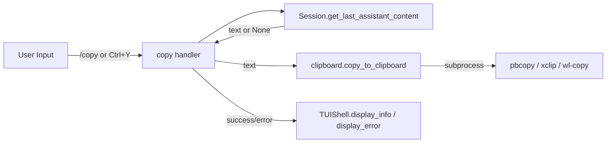

# Design Document: Copy Last Agent Output

## Overview

Add the ability to copy the most recent agent response (raw markdown) to the
system clipboard via a `/copy` slash command and a `Ctrl+Y` keyboard shortcut.
The implementation adds a small clipboard utility module, a new built-in
command, and a prompt-toolkit key binding.

## Architecture



### Module Responsibilities

1. **`clipboard.py`** — Platform-aware clipboard write using subprocess.
2. **`builtin_commands.py`** — Registers `/copy` command; handler calls
   clipboard module.
3. **`session.py`** — Exposes `get_last_assistant_content()` convenience method.
4. **`tui.py`** — Adds `Ctrl+Y` key binding to the prompt-toolkit session that
   invokes the same copy logic.

## Components and Interfaces

### CLI Surface

| Trigger   | Action                                   |
|-----------|------------------------------------------|
| `/copy`   | Copy last agent output to clipboard      |
| `Ctrl+Y`  | Copy last agent output to clipboard      |

### Core Data Types

No new data types are introduced.

### Module Interfaces

#### `clipboard.py`

```python
def copy_to_clipboard(text: str) -> None:
    """Copy text to the system clipboard.

    Raises:
        ClipboardError: If the clipboard utility is not found or the
                        subprocess fails.
    """
```

#### `exceptions.py` (addition)

```python
class ClipboardError(Exception):
    """Raised when a clipboard operation fails."""
```

#### `session.py` (addition)

```python
def get_last_assistant_content(self) -> str | None:
    """Return the content of the most recent assistant turn, or None."""
```

#### `builtin_commands.py` (addition)

```python
def create_copy_command() -> SlashCommand:
    """Create the /copy command."""
```

#### `tui.py` (addition)

A `Ctrl+Y` key binding registered on the prompt-toolkit `PromptSession` that
calls the same copy logic and prints feedback via `display_info` / `display_error`.

## Data Models

No new persistent data models. The feature reads existing
`ConversationTurn.content` from the session history.

## Operational Readiness

- **Observability:** Errors from the subprocess clipboard call are displayed to
  the user. No additional logging beyond existing `logger` usage.
- **Rollout:** Additive feature; no migration or backward-compatibility
  concerns.
- **Compatibility:** Requires `pbcopy` (macOS), `xclip` (Linux/X11), or
  `wl-copy` (Linux/Wayland). Graceful error if none are available.

## Correctness Properties

### Property 1: Content Integrity

*For any* assistant turn stored in the session, the text copied to the clipboard
SHALL be byte-for-byte identical to `ConversationTurn.content`.

**Validates: Requirements 3.1, 3.2, 3.3**

### Property 2: Last-Turn Selection

*For any* session with one or more assistant turns, `get_last_assistant_content()`
SHALL return the `content` of the assistant turn with the highest index.

**Validates: Requirements 1.1, 2.1**

### Property 3: Empty-Session Guard

*For any* session with zero assistant turns, the copy handler SHALL not invoke
the clipboard utility and SHALL display the "No agent output to copy." message.

**Validates: Requirements 1.2, 2.2**

### Property 4: Platform Dispatch

*For any* supported platform (`darwin`, `linux`), `copy_to_clipboard` SHALL
invoke the correct platform-specific clipboard utility.

**Validates: Requirements 4.1, 4.2, 4.3**

### Property 5: Missing Utility Handling

*For any* platform where the clipboard utility is absent,
`copy_to_clipboard` SHALL raise `ClipboardError` with a message identifying the
missing utility.

**Validates: Requirements 1.4, 4.4**

## Error Handling

| Error Condition                        | System Behavior                                              |
|----------------------------------------|--------------------------------------------------------------|
| No assistant turns in session          | Display info: "No agent output to copy."                     |
| Clipboard utility not found            | Display error: "Clipboard utility not found: {utility name}" |
| Clipboard subprocess fails (non-zero)  | Display error: "Clipboard copy failed: {stderr}"             |

## Definition of Done

A task group is complete when ALL of the following are true:

1. All subtasks within the group are checked off (`[x]`)
2. All property tests for the task group pass
3. All previously passing tests still pass (no regressions)
4. No linter warnings or errors introduced
5. Code is committed on a feature branch and pushed to remote
6. Feature branch is merged back to `develop`
7. `tasks.md` checkboxes are updated to reflect completion

## Testing Strategy

- **Unit tests:** Test `Session.get_last_assistant_content()` with 0, 1, and
  multiple assistant/user turns. Test `/copy` handler with mocked clipboard and
  session.
- **Property-based tests (Hypothesis):** Generate arbitrary sequences of
  `ConversationTurn` objects and verify `get_last_assistant_content()` returns
  the correct one (Property 2). Generate arbitrary strings and verify
  `copy_to_clipboard` passes them unmodified to the subprocess stdin
  (Property 1).
- **Integration tests:** Test `copy_to_clipboard` with a mock subprocess to
  verify correct utility selection per platform (Property 4) and error handling
  (Property 5).
