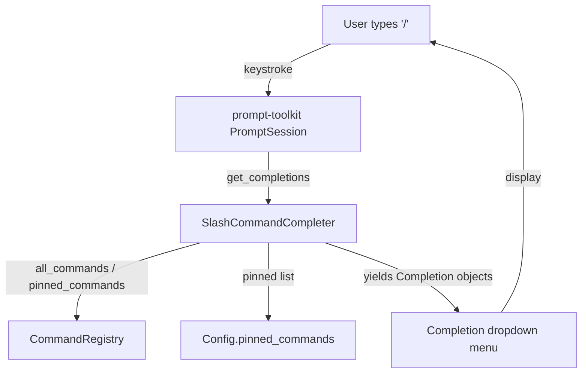

# Design Document: Slash Command Menu

## Overview

Replace the existing `WordCompleter`-based tab completion with a custom
`SlashCommandCompleter` that provides an auto-popup dropdown menu when `/` is
typed at the start of the input line. The completer is aware of pinned commands
and supports real-time type-ahead filtering.

The design leverages prompt-toolkit's built-in completion system (completer
protocol, completion menu rendering, Escape-to-dismiss) rather than building
custom UI. This minimizes new code and ensures consistency with standard
terminal autocomplete UX.

## Architecture



### Module Responsibilities

1. **SlashCommandCompleter** (`src/agent_repl/completer.py`) — Custom
   prompt-toolkit `Completer` that yields command completions based on input
   state. Knows about pinned commands vs. all commands.

2. **CommandRegistry** (`src/agent_repl/command_registry.py`) — Extended with a
   `pinned_commands()` method that returns the ordered set of pinned commands.

3. **Config** (`src/agent_repl/types.py`) — Extended with an optional
   `pinned_commands` field.

4. **SlashCommand** (`src/agent_repl/types.py`) — Extended with an optional
   `pinned` boolean field.

5. **TUIShell** (`src/agent_repl/tui.py`) — Updated to use
   `SlashCommandCompleter` instead of `WordCompleter`, and to enable
   `complete_while_typing=True`.

6. **App** (`src/agent_repl/app.py`) — Passes the pinned commands configuration
   to the TUI/completer setup.

## Components and Interfaces

### New Module: `completer.py`

```python
from prompt_toolkit.completion import Completer, Completion
from prompt_toolkit.document import Document

class SlashCommandCompleter(Completer):
    """Completer that provides slash command completions with pinned support."""

    def __init__(
        self,
        commands: list[SlashCommand],
        pinned_names: list[str],
        max_pinned_display: int = 6,
    ) -> None: ...

    def update_commands(
        self,
        commands: list[SlashCommand],
        pinned_names: list[str],
    ) -> None:
        """Update the command list (e.g., after plugins load new commands)."""
        ...

    def get_completions(
        self, document: Document, complete_event: CompleteEvent
    ) -> Iterable[Completion]:
        """Yield completions based on current input."""
        ...
```

### Modified: `CommandRegistry`

```python
class CommandRegistry:
    def pinned_commands(self, pinned_names: list[str]) -> list[SlashCommand]:
        """Return pinned commands in the order specified by pinned_names,
        then any commands with pinned=True not already in the list."""
        ...
```

### Modified: `SlashCommand`

```python
@dataclass
class SlashCommand:
    name: str
    description: str
    help_text: str
    handler: Callable[[CommandContext], None]
    pinned: bool = False  # NEW FIELD
```

### Modified: `Config`

```python
@dataclass
class Config:
    ...
    pinned_commands: list[str] | None = None  # NEW FIELD
```

### Modified: `TUIShell.__init__`

- Replace `WordCompleter([], sentence=True)` with `SlashCommandCompleter(...)`.
- Set `complete_while_typing=True` on the `PromptSession`.

### Modified: `App._run_async`

- After registering all commands, create the `SlashCommandCompleter` with the
  resolved command list and pinned names.
- Pass the completer to TUIShell (via a new `set_completer` method or
  constructor parameter).

## Data Models

### Pinned Commands Resolution

The pinned command set is resolved as follows:

1. Start with `Config.pinned_commands` if provided; otherwise use
   `DEFAULT_PINNED_COMMANDS = ["help", "quit"]`.
2. Append any registered `SlashCommand` instances where `pinned=True` that are
   not already in the list.
3. Truncate to `MAX_PINNED_DISPLAY` (6) entries.

### Completion Entry Format

Each `Completion` object is constructed as:

```python
Completion(
    text=f"/{command.name}",        # inserted text
    start_position=-len(prefix),    # replace from '/' onward
    display=f"/{command.name}",     # left column in dropdown
    display_meta=command.description,  # right column (dimmed)
)
```

## Operational Readiness

- **No external dependencies:** Uses only prompt-toolkit's built-in completion
  system, which is already a project dependency.
- **Rollback:** Revert to `WordCompleter` by removing the new module and
  reverting TUIShell changes.
- **Migration:** The new `pinned` field on `SlashCommand` defaults to `False`,
  so existing consumer code is unaffected. The `pinned_commands` config field
  defaults to `None` (use built-in defaults).

## Correctness Properties

### Property 1: Pinned-Only Initial Display

*For any* set of registered commands where the total exceeds the pinned set,
the `SlashCommandCompleter` SHALL yield only pinned commands when the input is
exactly `/`.

**Validates: Requirements 2.1, 2.4**

### Property 2: Prefix Filter Completeness

*For any* prefix string P typed after `/`, the `SlashCommandCompleter` SHALL
yield exactly the set of registered commands whose names start with P,
regardless of pinned status.

**Validates: Requirements 3.1, 3.2**

### Property 3: Empty Prefix Reversion

*For any* sequence of keystrokes that results in the input being exactly `/`
(including after deletions), the `SlashCommandCompleter` SHALL yield only
pinned commands (identical to the initial display).

**Validates: Requirements 3.4, 2.1**

### Property 4: Non-Slash Inactivity

*For any* input text that does not start with `/`, the
`SlashCommandCompleter` SHALL yield zero completions.

**Validates: Requirement 1.4**

### Property 5: Pinned Merge and Deduplication

*For any* combination of `Config.pinned_commands` list and `SlashCommand`
instances with `pinned=True`, the resolved pinned set SHALL contain no
duplicates, and configured names SHALL appear before declaratively-pinned names.

**Validates: Requirements 2.6, 2.2**

### Property 6: Display Format Correctness

*For any* command yielded as a `Completion`, the `display` field SHALL equal
`"/{command.name}"` and the `display_meta` field SHALL equal
`command.description`.

**Validates: Requirement 1.2**

### Property 7: Pinned Cap Enforcement

*For any* pinned set exceeding 6 entries, the `SlashCommandCompleter` SHALL
yield at most 6 completions when the input is exactly `/`.

**Validates: Requirement 2.4**

### Property 8: Backward Compatibility Default

*For any* `Config` instance where `pinned_commands` is `None`, the resolved
pinned set SHALL be `["help", "quit"]`.

**Validates: Requirement 5.1**

## Error Handling

| Error Condition | System Behavior |
|-----------------|-----------------|
| `pinned_commands` contains a name not registered in CommandRegistry | Silently skip the unknown name; do not crash |
| No commands registered at all | Yield zero completions for any input |
| Plugin registers a command after initial setup | Completer is updated via `update_commands()` |
| `pinned_commands` is an empty list `[]` | Show zero pinned commands on `/`; all commands accessible via type-ahead |

## Definition of Done

A task group is complete when ALL of the following are true:

1. All subtasks within the group are checked off (`[x]`)
2. All property tests for the task group pass
3. All previously passing tests still pass (no regressions)
4. No linter warnings or errors introduced
5. Code is committed on a feature branch and pushed to remote
6. Feature branch is merged back to `develop`
7. `tasks.md` checkboxes are updated to reflect completion

## Testing Strategy

### Unit Tests

- **`SlashCommandCompleter.get_completions`**: Test with various document
  states (just `/`, `/he`, `/nonexistent`, empty string, `hello /`).
- **Pinned resolution**: Test merge logic with various combinations of
  config list and declaratively-pinned commands.
- **`CommandRegistry.pinned_commands`**: Test ordering and deduplication.

### Property-Based Tests (Hypothesis)

- Generate random sets of commands and pinned lists; verify properties 1-8
  hold.
- Generate random prefix strings; verify filter completeness (property 2).

### Integration Tests

- Verify the completion menu activates in a prompt-toolkit
  `create_app_session` test harness.
- Verify Escape dismisses the menu (prompt-toolkit default behavior, but
  confirm it works with our custom completer).
