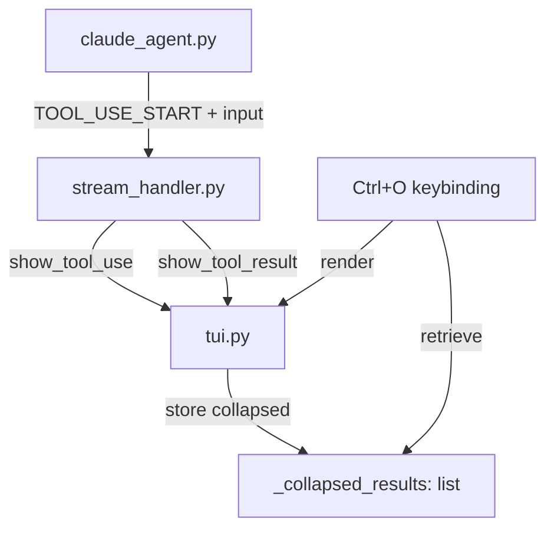

# Design Document: Tool Display Enhancement

## Overview

This enhancement modifies three components to improve tool display in the TUI:
the agent layer (to include tool input in events), the stream handler (to pass
input data through), and the TUI shell (to render enhanced invocations, dim
output, and collapsible results). A `Ctrl+O` keyboard shortcut is added to
expand the most recently collapsed output.

## Architecture



### Module Responsibilities

1. **claude_agent.py** - Include `block.input` in `TOOL_USE_START` event data.
2. **stream_handler.py** - Pass tool input to new TUI method; pass tool result data unchanged.
3. **tui.py** - Render enhanced tool invocations with compact summary; render tool results as dim text with collapsible output; store collapsed results; provide `show_expanded_result()` method.
4. **tui.py** - Register `Ctrl+O` key binding for expanding collapsed output.

## Components and Interfaces

### Modified: `claude_agent.py._translate_message()`

Add `block.input` to the `TOOL_USE_START` event:

```python
# Before
data={"name": block.name, "id": block.id}

# After
data={"name": block.name, "id": block.id, "input": block.input}
```

### Modified: `stream_handler.py.handle_stream()`

Update `TOOL_USE_START` handling to pass input data:

```python
elif event.type == StreamEventType.TOOL_USE_START:
    name = event.data.get("name", "unknown")
    tool_input = event.data.get("input", {})
    self._tui.show_tool_use(name, tool_input)
```

Update `TOOL_RESULT` handling to pass through to renamed method:

```python
elif event.type == StreamEventType.TOOL_RESULT:
    name = event.data.get("name", "unknown")
    result = event.data.get("result", "")
    is_error = event.data.get("is_error", False)
    self._tui.show_tool_result(name, result, is_error)
```

### Modified: `tui.py.TUIShell`

#### New method: `show_tool_use(name, tool_input)`

```python
def show_tool_use(self, name: str, tool_input: dict[str, Any]) -> None:
    """Render tool invocation with name and compact input summary."""
```

#### Modified method: `show_tool_result(name, result, is_error)`

Replace Panel rendering with dim text + collapsible logic:

```python
def show_tool_result(self, name: str, result: str, is_error: bool) -> None:
    """Render tool result as dim text with optional collapse."""
```

#### New method: `show_expanded_result(index)`

```python
def show_expanded_result(self, index: int) -> None:
    """Display full output of a previously collapsed tool result."""
```

#### New state: `_collapsed_results`

```python
self._collapsed_results: list[str] = []  # Full text of collapsed outputs
```

### Helper function: `_format_compact_summary(tool_input)`

```python
def _format_compact_summary(tool_input: dict[str, Any]) -> str:
    """Format tool input as compact key: value pairs, truncating long values."""
```

Formatting rules:
- Each key-value pair: `key: value`
- Pairs separated by two spaces
- Values longer than 60 chars truncated with "..."
- Nested objects: JSON-serialized then truncated
- Empty dict returns empty string

### New: `Ctrl+O` key binding

Registered in `TUIShell.__init__()` alongside the existing `Ctrl+Y` binding:

```python
@self._kb.add("c-o")
def _expand_handler(event: Any) -> None:
    if self._collapsed_results:
        self.show_expanded_result()
    else:
        self._console.print(
            Text("No collapsed output to expand.", style=self._theme.info_color)
        )
```

## Data Models

### `TOOL_USE_START` event data (modified)

```python
{
    "name": str,       # Tool name (existing)
    "id": str,         # Tool use ID (existing)
    "input": dict,     # Tool input parameters (NEW)
}
```

### Collapsed result storage

Simple list of strings stored on `TUIShell`:
- Appended in order as collapsed results occur
- `Ctrl+O` always expands the last element (most recent)
- Cleared when session is cleared (via `/clear`)

## Correctness Properties

### Property 1: Tool Input Inclusion

*For any* `ToolUseBlock` received from the SDK, the `TOOL_USE_START` stream
event SHALL include the block's input dictionary in its data payload.

**Validates: Requirement 1.6**

### Property 2: Compact Summary Completeness

*For any* non-empty tool input dictionary, `_format_compact_summary()` SHALL
produce a string containing every top-level key from the input.

**Validates: Requirements 1.2, 1.3**

### Property 3: Value Truncation Bound

*For any* input value string, the rendered value in the compact summary SHALL
NOT exceed 63 characters (60 chars + "...").

**Validates: Requirement 1.3**

### Property 4: No Panel Usage

*For any* tool result rendering, the TUI SHALL NOT instantiate a `rich.panel.Panel`.

**Validates: Requirement 2.3**

### Property 5: Collapse Threshold

*For any* non-error tool result with more than 3 lines, the rendered output
SHALL contain exactly 3 content lines plus one collapse hint line.

**Validates: Requirements 3.1, 3.2, 3.5**

### Property 6: Error Output Completeness

*For any* error tool result (is_error=True), the rendered output SHALL contain
all lines of the original result regardless of line count.

**Validates: Requirement 3.5**

### Property 7: Collapsed Storage Integrity

*For any* collapsed tool result, the full text stored in `_collapsed_results`
SHALL be byte-identical to the original result string.

**Validates: Requirements 3.6, 4.2**

### Property 8: Expand Index Validity

*For any* non-empty `_collapsed_results` list, pressing `Ctrl+O` SHALL display
the last element of `_collapsed_results` (the most recently collapsed result).

**Validates: Requirements 4.1, 4.2**

### Property 9: Empty Input Omission

*For any* tool invocation with an empty input dictionary, the TUI SHALL render
only the tool name line without a compact summary line.

**Validates: Requirements 1.5, Edge Case 1.1**

## Error Handling

| Error Condition | System Behavior |
|----------------|-----------------|
| Tool input is empty dict | Omit summary line, show only tool name |
| Tool input value is None | Display as `key: ""` |
| Tool result is empty string | Show header only, no body |
| `Ctrl+O` with no collapsed results | Show info: "No collapsed output to expand." |
| `Ctrl+O` during active streaming | Ignore keypress (no action) |
| SDK ToolUseBlock has no input attr | Default to empty dict |

## Definition of Done

A task group is complete when ALL of the following are true:

1. All subtasks within the group are checked off (`[x]`)
2. All property tests for the task group pass
3. All previously passing tests still pass (no regressions)
4. No linter warnings or errors introduced
5. Code is committed on a feature branch and pushed to remote
6. Feature branch is merged back to `main`
7. `tasks.md` checkboxes are updated to reflect completion

## Testing Strategy

- **Unit tests**: Test `_format_compact_summary()` with various input dicts
  (empty, single key, multiple keys, long values, nested objects, None values).
- **Unit tests**: Test `show_tool_result()` with outputs of varying lengths
  (0, 1, 3, 4, 100 lines) and verify collapse behavior.
- **Unit tests**: Test `Ctrl+O` expand behavior (no results, single result,
  multiple results - always expands most recent).
- **Property-based tests**: Use Hypothesis to generate arbitrary input dicts
  and verify compact summary properties (all keys present, values truncated
  correctly).
- **Property-based tests**: Generate arbitrary multi-line strings and verify
  collapse threshold behavior.
- **Integration tests**: End-to-end stream handling with `TOOL_USE_START` events
  containing input data, verifying TUI output.
- **Regression tests**: Ensure existing tool result tests still pass with
  updated rendering (no Panel).
