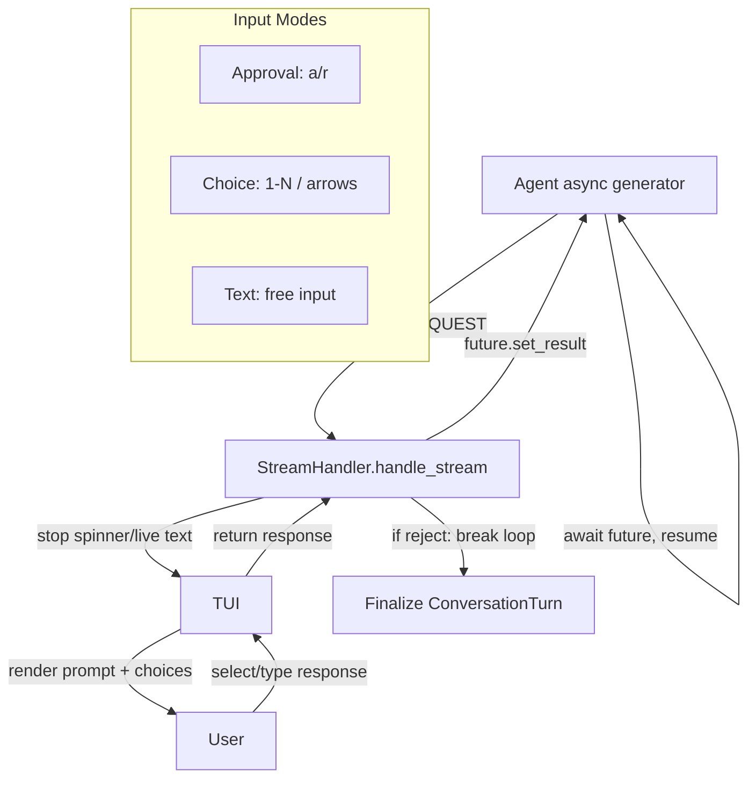

# Design Document: Agent Input Requests

## Overview

This feature extends the streaming event model with an `INPUT_REQUEST` event
type that allows agents to pause their response stream and solicit user input.
The mechanism uses an `asyncio.Future` embedded in the event data as a
bidirectional channel: the agent yields the event and awaits the future, while
the stream handler prompts the user and resolves the future with their response.
Three input modes are supported: binary approval, numbered choice selection,
and free-text input.

## Architecture



### Module Responsibilities

1. **types.py** - Add `INPUT_REQUEST` to `StreamEventType` enum.
2. **stream_handler.py** - Detect `INPUT_REQUEST` events, pause iteration,
   delegate to TUI for user input, resolve the response future, handle
   rejection by breaking the loop.
3. **tui.py** - Implement `prompt_approval()`, `prompt_choice()`, and
   `prompt_text_input()` methods for the three input modes. Handle arrow key
   navigation for choice mode.
4. **Agent plugins** (e.g., `claude_agent.py`) - Yield `INPUT_REQUEST` events
   with an `asyncio.Future`, await the future to receive user response.

## Components and Interfaces

### Modified: `types.py`

Add new enum member:

```python
class StreamEventType(Enum):
    TEXT_DELTA = "text_delta"
    TOOL_USE_START = "tool_use_start"
    TOOL_RESULT = "tool_result"
    USAGE = "usage"
    ERROR = "error"
    INPUT_REQUEST = "input_request"  # NEW
```

### Modified: `stream_handler.py.handle_stream()`

New branch in the event dispatch:

```python
elif event.type == StreamEventType.INPUT_REQUEST:
    # Pause streaming UI
    self._tui.stop_spinner()
    if live_started:
        self._tui.finalize_live_text()
        live_started = False

    prompt = event.data.get("prompt", "")
    input_type = event.data.get("input_type", "approval")
    choices = event.data.get("choices", [])
    response_future = event.data.get("response_future")

    if response_future is None:
        logger.warning("INPUT_REQUEST missing response_future, skipping")
        continue

    # Collect user input based on mode
    response = await self._collect_input(prompt, input_type, choices)

    # Resolve the future so the agent generator can resume
    response_future.set_result(response)

    # If rejected, cancel the stream
    if response == "reject":
        self._tui.show_info("Rejected. Agent response cancelled.")
        break

    # Restart spinner for continued agent processing
    self._tui.start_spinner()
```

New private method:

```python
async def _collect_input(
    self,
    prompt: str,
    input_type: str,
    choices: list[str],
) -> str | dict:
    """Dispatch to the appropriate TUI input method."""
    if input_type == "approval":
        return await self._tui.prompt_approval(prompt, choices)
    elif input_type == "choice":
        return await self._tui.prompt_choice(prompt, choices)
    elif input_type == "text":
        return await self._tui.prompt_text_input(prompt)
    else:
        self._tui.show_error(f"Unknown input type: {input_type}")
        return "reject"
```

### New TUI methods: `tui.py`

#### `prompt_approval(prompt, choices) -> str`

```python
async def prompt_approval(self, prompt: str, choices: list[str]) -> str:
    """Display binary approval prompt. Returns 'approve' or 'reject'."""
```

Rendering:
- Print prompt in default style
- Print `[a] {choices[0]}  [r] {choices[1]}` with approve in info_color,
  reject in error_color
- Prompt with `? ` glyph in info_color
- Loop until valid input (`a`, `1`, `r`, `2`)
- Return `"approve"` or `"reject"`

#### `prompt_choice(prompt, choices) -> str | dict`

```python
async def prompt_choice(
    self, prompt: str, choices: list[str]
) -> str | dict[str, Any]:
    """Display numbered choice list with arrow navigation. Returns choice
    dict or 'reject'."""
```

Rendering:
- Print prompt in default style
- Print numbered choices: `  1) Choice A`, `  2) Choice B`, ...
- Print `  r) Reject` in error_color
- Use a dedicated `PromptSession` with custom key bindings:
  - Up/Down arrows: change highlighted selection
  - Number keys: select directly
  - `r`: reject
  - Enter: confirm current highlight
- Highlighted choice shown with `▸` pointer and bold styling
- Return `{"index": N, "value": "Choice text"}` or `"reject"`

#### `prompt_text_input(prompt) -> str`

```python
async def prompt_text_input(self, prompt: str) -> str:
    """Display text input prompt. Returns input string or 'reject'."""
```

Rendering:
- Print prompt in default style
- Print hint in dim: `(type r or /reject to abort)`
- Prompt with `? ` glyph in info_color
- Loop until non-empty input
- Return the input string, or `"reject"` if input is `r` or `/reject`

### Agent-side usage pattern

Example of how an agent plugin yields an input request:

```python
import asyncio

async def _stream_from_query(self, prompt: str) -> AsyncIterator[StreamEvent]:
    # ... normal streaming ...

    # Agent needs approval
    response_future: asyncio.Future[str | dict] = asyncio.Future()
    yield StreamEvent(
        type=StreamEventType.INPUT_REQUEST,
        data={
            "prompt": "The agent wants to delete 3 files. Proceed?",
            "input_type": "approval",
            "choices": ["Approve", "Reject"],
            "response_future": response_future,
        },
    )
    response = await response_future
    if response == "reject":
        return  # Generator ends

    # Continue with approved action...
```

## Data Models

### `INPUT_REQUEST` event data schema

```python
{
    "prompt": str,             # Description/question for the user
    "input_type": str,         # "approval" | "choice" | "text"
    "choices": list[str],      # Choice labels (required for approval/choice)
    "response_future": Future, # asyncio.Future resolved with user response
}
```

### Response values by mode

| Mode | Approve/Select Response | Reject Response |
|------|------------------------|-----------------|
| approval | `"approve"` | `"reject"` |
| choice | `{"index": int, "value": str}` | `"reject"` |
| text | `str` (user's text) | `"reject"` |

## Correctness Properties

### Property 1: Stream Pause Guarantee

*For any* `INPUT_REQUEST` event yielded by an agent, the stream handler SHALL
stop iterating events and prompt the user before calling `__anext__()` on the
generator again.

**Validates: Requirements 2.3, 2.6**

### Property 2: Future Resolution Guarantee

*For any* `INPUT_REQUEST` event with a valid `response_future`, the stream
handler SHALL resolve the future exactly once before continuing or breaking
the loop.

**Validates: Requirements 2.4, 2.5**

### Property 3: Approval Binary Constraint

*For any* approval-mode input request, the response SHALL be either the string
`"approve"` or the string `"reject"` and no other value.

**Validates: Requirements 3.5, 3.6**

### Property 4: Choice Index Validity

*For any* choice-mode input request with N choices, the response (when not
rejected) SHALL contain an `"index"` value in range `[0, N-1]` and a `"value"`
matching `choices[index]`.

**Validates: Requirements 4.6**

### Property 5: Rejection Cancels Stream

*For any* input request where the user selects reject, the stream handler SHALL
break the event iteration loop and finalize the conversation turn with partial
content.

**Validates: Requirements 6.1, 6.2, 6.3**

### Property 6: UI State Cleanup Before Prompt

*For any* `INPUT_REQUEST` event, the stream handler SHALL stop the spinner and
finalize live text before displaying the input prompt to the user.

**Validates: Requirements 2.1, 2.2**

### Property 7: History Preservation on Rejection

*For any* rejection, the session history SHALL retain all conversation turns
accumulated before and during the rejected stream.

**Validates: Requirements 6.4**

### Property 8: Re-prompt on Invalid Input

*For any* invalid user input during an approval or choice prompt, the TUI SHALL
re-display the prompt with a hint and not resolve the future until valid input
is received.

**Validates: Requirements 3.E1, 4.E1, 4.E2, 5.E1**

## Error Handling

| Error Condition | System Behavior |
|----------------|-----------------|
| `response_future` missing from event data | Log warning, skip the request, continue stream |
| Empty `choices` for approval/choice mode | Show error message, treat as rejection |
| Unknown `input_type` value | Show error message, treat as rejection |
| `Ctrl+C` during input prompt | Treat as rejection, cancel stream |
| User enters invalid input (wrong number, etc.) | Re-prompt with hint |
| Multiple `INPUT_REQUEST` events in one stream | Handle each sequentially |
| Agent generator closed after rejection | Normal cleanup, no error |

## Definition of Done

A task group is complete when ALL of the following are true:

1. All subtasks within the group are checked off (`[x]`)
2. All property tests for the task group pass
3. All previously passing tests still pass (no regressions)
4. No linter warnings or errors introduced
5. Code is committed on a feature branch and pushed to remote
6. Feature branch is merged back to `main`
7. `tasks.md` checkboxes are updated to reflect completion

## Testing Strategy

- **Unit tests**: Test each TUI input method (`prompt_approval`,
  `prompt_choice`, `prompt_text_input`) with mocked prompt_toolkit input.
- **Unit tests**: Test stream handler `INPUT_REQUEST` dispatch with mocked TUI
  methods, verifying future resolution and loop control.
- **Unit tests**: Test rejection behavior: verify stream breaks, partial turn
  is finalized, history is preserved.
- **Property-based tests**: Generate arbitrary choice lists and verify index
  validity of responses (Property 4).
- **Property-based tests**: Verify approval responses are always binary
  (Property 3).
- **Integration tests**: Full stream with an agent that yields
  `INPUT_REQUEST`, verifying end-to-end pause/resume flow.
- **Integration tests**: Agent yields text, then input request, then more text
  after approval. Verify all content appears in final conversation turn.
