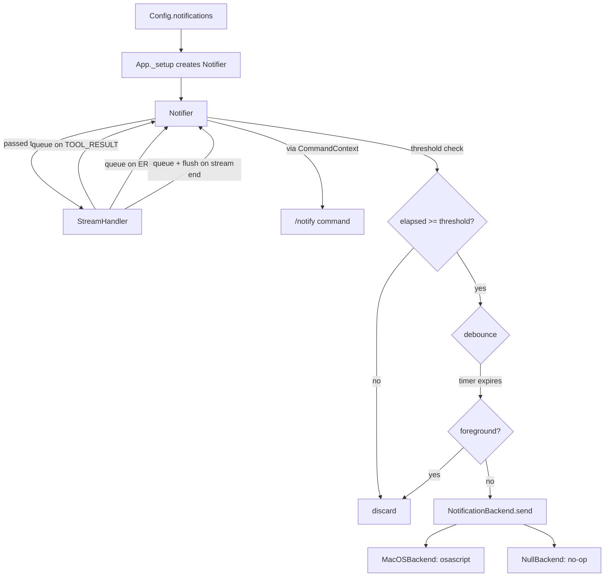

# Design Document: Desktop Notifications

## Overview

The notification system is implemented as a standalone `Notifier` class backed by
a platform-abstracted `NotificationBackend` protocol. On macOS, notifications
are sent via `osascript` (zero dependencies). On other platforms, a `NullBackend`
silently discards notifications. The `Notifier` handles debouncing, time
threshold checks, and foreground detection. It integrates with `StreamHandler`
(for triggers), `App` (for wiring), and `BuiltinCommandsPlugin` (for the
`/notify` command).

## Architecture



### Module Responsibilities

1. **notifier.py** (NEW) — `NotificationConfig`, `NotificationBackend` protocol,
   `MacOSBackend`, `NullBackend`, `Notifier` class with debounce/threshold/
   foreground logic, `_create_backend()` factory.
2. **types.py** — Add `NotificationConfig` import and `notifications` field to
   `Config`; add `notifier` field to `CommandContext`.
3. **app.py** — Parse `[notifications]` from config TOML, create `Notifier`,
   wire to `StreamHandler` and `CommandContext`.
4. **stream_handler.py** — Accept optional `Notifier`; call `mark_turn_start()`
   at stream begin; queue notifications on `TOOL_RESULT`, `ERROR`, and stream
   completion; flush at end.
5. **builtin_commands.py** — Register `/notify` slash command.
6. **config_loader.py** — Update default config template with `[notifications]`
   section.

## Components and Interfaces

### New: `notifier.py`

```python
from __future__ import annotations

import asyncio
import logging
import platform
import shutil
import subprocess
import time
from dataclasses import dataclass, field
from typing import Protocol, runtime_checkable

logger = logging.getLogger(__name__)

# --- Configuration ---

@dataclass(frozen=True)
class NotificationConfig:
    """Notification preferences. Parsed from [notifications] in config.toml."""
    enabled: bool = False
    sound: str | None = "default"
    threshold_seconds: int = 60
    debounce_seconds: float = 5.0

    @classmethod
    def from_dict(cls, data: dict) -> NotificationConfig:
        """Parse from a raw dict. Clamps threshold_seconds to minimum 60."""
        try:
            return cls(
                enabled=bool(data.get("enabled", False)),
                sound=data.get("sound", "default"),
                threshold_seconds=max(60, int(data.get("threshold_seconds", 60))),
                debounce_seconds=float(data.get("debounce_seconds", 5.0)),
            )
        except (TypeError, ValueError) as e:
            logger.warning("Invalid notification config, using defaults: %s", e)
            return cls()


# --- Backend Protocol ---

@runtime_checkable
class NotificationBackend(Protocol):
    def is_available(self) -> bool: ...
    def send(self, title: str, message: str, sound: str | None) -> None: ...


# --- macOS Backend ---

class MacOSBackend:
    """Sends notifications via osascript on macOS."""

    def is_available(self) -> bool:
        return platform.system() == "Darwin" and shutil.which("osascript") is not None

    def send(self, title: str, message: str, sound: str | None) -> None:
        parts = [f'display notification {_applescript_quote(message)}']
        parts.append(f'with title {_applescript_quote(title)}')
        if sound is not None:
            parts.append(f'sound name {_applescript_quote(sound)}')
        script = " ".join(parts)
        try:
            subprocess.run(
                ["osascript", "-e", script],
                capture_output=True,
                timeout=5,
            )
        except (subprocess.TimeoutExpired, OSError) as e:
            logger.warning("Failed to send notification: %s", e)


# --- Null Backend ---

class NullBackend:
    """Silent no-op backend for unsupported platforms."""

    def is_available(self) -> bool:
        return False

    def send(self, title: str, message: str, sound: str | None) -> None:
        pass


# --- Foreground Detection ---

_TERMINAL_BUNDLE_IDS: set[str] = {
    "com.apple.Terminal",
    "com.googlecode.iterm2",
    "dev.warp.Warp-Stable",
    "com.mitchellh.ghostty",
}

try:
    from AppKit import NSWorkspace
    _APPKIT_AVAILABLE = True
except ImportError:
    _APPKIT_AVAILABLE = False


def _is_terminal_foreground() -> bool:
    """Check if a known terminal is the frontmost macOS app.

    Returns False (not foreground) if AppKit is unavailable,
    meaning notifications will always be delivered.
    """
    if not _APPKIT_AVAILABLE:
        return False
    try:
        app = NSWorkspace.sharedWorkspace().frontmostApplication()
        bundle = app.bundleIdentifier()
        return bundle in _TERMINAL_BUNDLE_IDS if bundle else False
    except Exception:
        return False


# --- Helpers ---

def _applescript_quote(s: str) -> str:
    """Escape a string for AppleScript double-quoted literals."""
    return '"' + s.replace('\\', '\\\\').replace('"', '\\"').replace('\n', ' ') + '"'


def _create_backend() -> NotificationBackend:
    """Select the appropriate backend for the current platform."""
    if platform.system() == "Darwin":
        return MacOSBackend()
    return NullBackend()


# --- Pending Notification ---

@dataclass
class _PendingNotification:
    message: str
    title: str


# --- Notifier ---

class Notifier:
    """Manages notification lifecycle: threshold, debounce, foreground, delivery."""

    def __init__(self, config: NotificationConfig, app_name: str = "agent_repl") -> None:
        self._config = config
        self._app_name = app_name
        self._enabled = config.enabled
        self._backend = _create_backend()
        self._turn_start_time: float | None = None
        self._pending: _PendingNotification | None = None
        self._debounce_task: asyncio.Task | None = None

    @property
    def enabled(self) -> bool:
        return self._enabled

    @enabled.setter
    def enabled(self, value: bool) -> None:
        self._enabled = value

    def mark_turn_start(self) -> None:
        """Record the start of a new agent turn for threshold calculation."""
        self._turn_start_time = time.monotonic()

    async def queue(self, message: str) -> None:
        """Queue a notification if threshold is met. Applies debounce."""
        if not self._should_notify():
            return
        truncated = message[:80] if message else "Response complete"
        self._pending = _PendingNotification(
            message=truncated,
            title=self._app_name,
        )
        self._reset_debounce_timer()

    async def flush(self) -> None:
        """Cancel debounce timer and deliver any pending notification now."""
        if self._debounce_task and not self._debounce_task.done():
            self._debounce_task.cancel()
            self._debounce_task = None
        if self._pending:
            await self._deliver(self._pending)
            self._pending = None

    def _should_notify(self) -> bool:
        """Check all preconditions for notification eligibility."""
        if not self._enabled:
            return False
        if not self._backend.is_available():
            return False
        if self._turn_start_time is None:
            return False
        elapsed = time.monotonic() - self._turn_start_time
        if elapsed < self._config.threshold_seconds:
            return False
        return True

    def _reset_debounce_timer(self) -> None:
        """Cancel existing timer and start a new one."""
        if self._debounce_task and not self._debounce_task.done():
            self._debounce_task.cancel()
        self._debounce_task = asyncio.create_task(self._debounce_fire())

    async def _debounce_fire(self) -> None:
        """Wait for debounce window, then deliver if still pending."""
        try:
            await asyncio.sleep(self._config.debounce_seconds)
        except asyncio.CancelledError:
            return
        if self._pending:
            # Check foreground at delivery time
            await self._deliver(self._pending)
            self._pending = None

    async def _deliver(self, notification: _PendingNotification) -> None:
        """Check foreground and send via backend in executor."""
        if _is_terminal_foreground():
            return
        loop = asyncio.get_running_loop()
        await loop.run_in_executor(
            None,
            self._backend.send,
            notification.title,
            notification.message,
            self._config.sound,
        )
```

### Modified: `types.py`

```python
from agent_repl.notifier import NotificationConfig

@dataclass
class Config:
    # ... existing fields ...
    notifications: NotificationConfig = field(default_factory=NotificationConfig)

@dataclass
class CommandContext:
    # ... existing fields ...
    notifier: Any = None  # Notifier | None (avoid circular import)
```

### Modified: `app.py`

In `_setup()`, after loading config:
```python
from agent_repl.notifier import NotificationConfig, Notifier

raw_notifications = loaded_config.raw.get("notifications", {})
notification_config = NotificationConfig.from_dict(raw_notifications)
self._notifier = Notifier(notification_config, app_name=self._config.app_name)
```

Wire to StreamHandler:
```python
self._stream_handler = StreamHandler(self._tui, self._session, notifier=self._notifier)
```

Note: the REPL creates the StreamHandler, so the Notifier must be passed through
REPL to StreamHandler. Alternatively, App can pass the Notifier directly to REPL
which passes it to StreamHandler.

Pass `notifier` through `CommandContext` in REPL (same pattern as `audit_logger`).

### Modified: `stream_handler.py`

```python
class StreamHandler:
    def __init__(self, tui, session, notifier=None):
        self._tui = tui
        self._session = session
        self._notifier = notifier

    async def handle_stream(self, events):
        if self._notifier:
            self._notifier.mark_turn_start()

        # ... existing event processing ...

        # On TOOL_RESULT event (after existing handling):
        if self._notifier:
            await self._notifier.queue(f"Tool completed: {name}")

        # On ERROR event (after existing handling):
        if self._notifier:
            await self._notifier.queue(message[:80])

        # After loop ends, before building ConversationTurn:
        if self._notifier:
            snippet = full_text[:80] if full_text.strip() else "Response complete"
            await self._notifier.queue(snippet)
            await self._notifier.flush()

        # ... build and return ConversationTurn ...
```

### Modified: `builtin_commands.py`

```python
SlashCommand(
    name="notify",
    description="Toggle desktop notifications",
    handler=_handle_notify,
    cli_exposed=True,
)

async def _handle_notify(ctx: CommandContext) -> None:
    notifier = ctx.notifier
    if notifier is None:
        ctx.tui.show_error("Notifier not available.")
        return
    if notifier.enabled:
        notifier.enabled = False
        ctx.tui.show_info("Notifications disabled.")
    else:
        notifier.enabled = True
        ctx.tui.show_info("Notifications enabled.")
```

### Modified: `config_loader.py`

Update the default config template to include:
```toml
# Desktop notifications (macOS only)
[notifications]
# enabled = false
# sound = "default"
# threshold_seconds = 60
# debounce_seconds = 5
```

## Data Models

### NotificationConfig

| Field | Type | Default | Description |
|-------|------|---------|-------------|
| `enabled` | `bool` | `False` | Whether notifications are active |
| `sound` | `str \| None` | `"default"` | macOS notification sound name, or None for silent |
| `threshold_seconds` | `int` | `60` | Minimum turn duration before notifications fire (min: 60) |
| `debounce_seconds` | `float` | `5.0` | Quiet period before delivering a buffered notification |

### Config TOML section

```toml
[notifications]
enabled = true
sound = "default"
threshold_seconds = 60
debounce_seconds = 5
```

### AppleScript template

```applescript
display notification "Response complete" with title "agent_repl" sound name "default"
```

## Operational Readiness

- **Observability**: All notification delivery failures are logged at `WARNING`
  level via the standard `logging` module. No silent failures.
- **Rollback**: The feature is entirely opt-in (`enabled = false` by default).
  Removing the `[notifications]` section from config disables it completely.
- **Migration**: No data migration needed. The new `[notifications]` section in
  `.af/config.toml` is additive and backward-compatible.

## Correctness Properties

### Property 1: Platform Safety

*For any* call to `Notifier.queue()` on a non-macOS platform, the system
SHALL NOT invoke any subprocess or produce any OS-level side effect.

**Validates: Requirements 8.4, 8.5**

### Property 2: Threshold Guard

*For any* notification-worthy event where the elapsed time since turn start
is less than `threshold_seconds`, the system SHALL discard the notification
without delivering it.

**Validates: Requirements 4.2, 4.3**

### Property 3: Foreground Suppression

*For any* pending notification where the terminal application is the
frontmost macOS app and AppKit is available, the system SHALL suppress
the notification without delivering it.

**Validates: Requirements 6.1, 6.2**

### Property 4: Debounce Coalescing

*For any* sequence of N notification-worthy events arriving within
`debounce_seconds` of each other (where N > 1), the system SHALL deliver
at most one notification containing the content of the last event.

**Validates: Requirements 5.1, 5.2, 5.3**

### Property 5: Flush Delivery

*For any* call to `Notifier.flush()` with a pending notification, the
system SHALL deliver that notification immediately (cancelling any active
debounce timer) if the terminal is not in the foreground.

**Validates: Requirements 5.4, 3.4**

### Property 6: Non-Blocking Delivery

*For any* notification delivery, the `osascript` subprocess SHALL be
executed in a thread executor so that the async event loop is never
blocked by the subprocess call.

**Validates: Requirement 7.2**

### Property 7: Config Clamping

*For any* `threshold_seconds` value provided in the config file that is
less than 60, the system SHALL clamp it to 60.

**Validates: Requirements 4.4, 1.4**

### Property 8: AppleScript Injection Safety

*For any* notification message containing backslashes, double quotes, or
newlines, the AppleScript string escaping SHALL produce a valid, safe
AppleScript literal that does not allow code injection.

**Validates: Requirements 7.8, 7.E3**

### Property 9: Backend Abstraction

*For any* interaction between the `Notifier` and the notification delivery
mechanism, the `Notifier` SHALL use only the `NotificationBackend` protocol
methods (`is_available()`, `send()`), never platform-specific code directly.

**Validates: Requirement 8.6**

### Property 10: Runtime Toggle Independence

*For any* invocation of `/notify`, the toggle SHALL change only the
in-memory `Notifier.enabled` state and SHALL NOT modify the config file
or any persistent storage.

**Validates: Requirements 2.3, 2.4**

### Property 11: Null Backend No-Op

*For any* call to `NullBackend.send()`, the method SHALL perform no I/O
and return immediately. `NullBackend.is_available()` SHALL always return
`False`.

**Validates: Requirements 8.3, 8.E2**

### Property 12: Message Truncation

*For any* notification message longer than 80 characters, the system SHALL
truncate it to 80 characters before passing it to the backend.

**Validates: Requirement 3.1 (80-char snippet)**

## Error Handling

| Error Condition | System Behavior |
|----------------|-----------------|
| `osascript` not found on PATH | `MacOSBackend.is_available()` returns `False`; notifications silently disabled |
| `osascript` returns non-zero exit code | Log warning, continue without crashing |
| `osascript` times out (>5s) | Log warning, continue without crashing |
| `AppKit` not importable | Skip foreground check, always deliver |
| `[notifications]` has wrong types | Log warning, use default `NotificationConfig` |
| `[notifications]` missing from TOML | Use default config (notifications disabled) |
| `Notifier` is None in `/notify` handler | Show error: "Notifier not available." |
| Non-macOS platform | `NullBackend` used; all operations are no-ops |
| `threshold_seconds < 60` in config | Clamped to 60 |

## Definition of Done

A task group is complete when ALL of the following are true:

1. All subtasks within the group are checked off (`[x]`)
2. All property tests for the task group pass
3. All previously passing tests still pass (no regressions)
4. No linter warnings or errors introduced
5. Code is committed on a feature branch and pushed to remote
6. Feature branch is merged back to `develop`
7. `tasks.md` checkboxes are updated to reflect completion

## Testing Strategy

- **Unit tests**: Test `NotificationConfig.from_dict()` parsing with valid,
  invalid, and partial configs. Verify clamping of `threshold_seconds`.
- **Unit tests**: Test `MacOSBackend` and `NullBackend` in isolation.
- **Unit tests**: Test `_applescript_quote()` with special characters.
- **Unit tests**: Test `Notifier` threshold logic with mocked `time.monotonic()`.
- **Unit tests**: Test `Notifier` debounce logic with mocked asyncio timers.
- **Unit tests**: Test `Notifier.flush()` immediate delivery.
- **Unit tests**: Test `_is_terminal_foreground()` with mocked AppKit.
- **Unit tests**: Test `/notify` command toggle behavior.
- **Property-based tests**: Generate arbitrary strings and verify
  `_applescript_quote()` produces valid escaped output (Property 8).
- **Property-based tests**: Generate random threshold/elapsed pairs and verify
  threshold guard behavior (Property 2).
- **Property-based tests**: Generate sequences of events and verify debounce
  produces at most one delivery per window (Property 4).
- **Integration tests**: Full stream with notification triggers, verify
  notification delivery with mocked backend.
